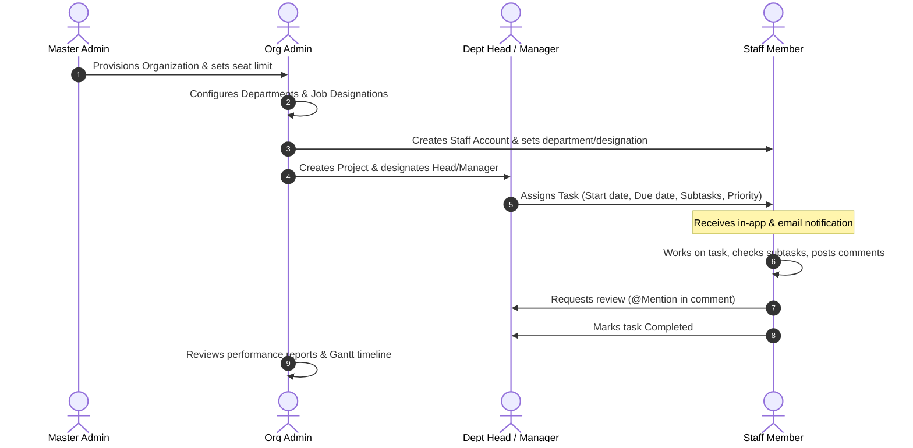

# MagnaFlow: Complete Architecture, Feature & Client Guide

**MagnaFlow** is a modern, multi-tenant project and task management platform engineered to provide enterprise-grade access control, project scheduling, and team collaboration—while running entirely within the **Firebase Spark (free) plan**.

This document provides a single, comprehensive guide covering everything about MagnaFlow: from high-level business concepts and client workflows down to technical architecture, security enforcement, and operational procedures.

---

## Table of Contents

1. [Executive Summary & Problem Statement](#1-executive-summary--problem-statement)
2. [What the Client Gets (Business & Non-Technical Perspective)](#2-what-the-client-gets-business--non-technical-perspective)
3. [The 6-Tier Role Hierarchy & Dashboards (Including Client Portal)](#3-the-6-tier-role-hierarchy--dashboards-including-client-portal)
4. [End-to-End Client Workflow & Lifecycle](#4-end-to-end-client-workflow--lifecycle)
5. [Core Features Deep Dive](#5-core-features-deep-dive)
6. [Engineering on the Firebase Spark Plan (The Zero-Cost Architecture)](#6-engineering-on-the-firebase-spark-plan-the-zero-cost-architecture)
7. [Resilience & Scale Engineering (Insights from the 50-Person Scale Test)](#7-resilience--scale-engineering-insights-from-the-50-person-scale-test)
8. [Codebase & Directory Structure](#8-codebase--directory-structure)
9. [Testing, Security & Operations Guide](#9-testing-security--operations-guide)

---

## 1. Executive Summary & Problem Statement

Organizations often struggle with fragmented communication across email, chat, and spreadsheets. Commercial task management platforms (like Asana, Monday.com, or Jira) can be prohibitively expensive, cumbersome to administer, and lack clear internal departmental scoping.

**MagnaFlow** solves this by providing:
- **Strict Multi-Tenancy:** Each client organization exists in complete logical isolation.
- **Granular 6-Tier Access Control:** Purpose-built views for Platform Owners, Executives, Department Heads, Project Managers, Staff, and External Clients.
- **Automated Timelines (Gantt Charts):** Live schedules rendered directly from task start and due dates without third-party chart dependencies.
- **Zero Cloud Operating Cost:** Operates 100% on Firebase's free tier without compromising on tenant isolation or security.

---

## 2. What the Client Gets (Business & Non-Technical Perspective)

For a business adopting MagnaFlow, the platform delivers:

### A Secure, Private Company Space
Every company receives a dedicated, private organization workspace. Even though multiple organizations may run on the same platform instance, data is ring-fenced at the database rule layer. One company can never view, query, or modify another company's staff, projects, or tasks.

### Clutter-Free, Role-Specific Experiences
Rather than exposing every employee to an intimidating, bloated interface, MagnaFlow personalizes what users see based on their responsibilities:
- **Executives** see business health, organizational charts, department workloads, and aggregate task velocity.
- **Managers** see deadlines, resource allocations, bottlenecks, and project Gantt timelines.
- **Staff** see an actionable, prioritized personal checklist of their daily assignments, subtasks, and feedback.

### External Stakeholder & Client Transparency
- **Guest / Client Portal (`/client`):** Allows clients, investors, or outside partners to view project progress, upcoming milestones, and delivery timelines without giving them access to internal team discussions, sensitive employee data, or editing capabilities.

### Clear Accountability & Visibility
- **No More Spreadsheet Chaos:** Every task is assigned to an accountable owner with clear start dates, deadlines, and priority levels (Low, Medium, High, Critical).
- **Subtask Checklists:** Work is broken into bite-sized milestones so managers can see progress in real time (e.g., 3 of 5 steps completed).
- **Contextual Discussions:** Comments live directly on the task itself. Teammates use `@Name` mentions to ping colleagues with in-app and email notifications.
- **Automated Morning Reminders:** Critical tasks that have slipped past their deadlines automatically trigger email notifications at 8:00 AM every morning.

---

## 3. The 5-Tier Role Hierarchy & Dashboards

MagnaFlow defines five distinct user roles. Each role is paired with a dedicated home route and layout:

```
                  ┌──────────────────────┐
                  │     Master Admin     │  (/master)
                  └──────────┬───────────┘
                             │ Provisions & monitors
                  ┌──────────▼───────────┐
                  │      Org Admin       │  (/admin)
                  └──────────┬───────────┘
                             │ Full control over organization
             ┌───────────────┴───────────────┐
             │                               │
  ┌──────────▼───────────┐        ┌──────────▼───────────┐
  │   Department Head    │        │    Project Manager   │
  │     (/department)    │        │       (/manager)     │
  └──────────┬───────────┘        └──────────┬───────────┘
             │ Scoped to Dept                │ Scoped to Project
             └───────────────┬───────────────┘
                             │ Delegates tasks
                  ┌──────────▼───────────┐
                  │        Staff         │  (/staff)
                  └──────────────────────┘
```

| Role | Route | Key Capabilities & Interface |
|---|---|---|
| **Master Admin** | `/master` | Platform owner view. Provisions new client organizations, sets user seat limits, suspends inactive orgs, reviews append-only audit logs (with user and org names resolved), and monitors the centralized crash log. |
| **Org Admin** | `/admin` | Complete operational control of their organization. Manages departments, job designations, project managers, staff members, cross-department tasks, and visual performance reports. (Legacy accounts with role `admin` are treated as aliases for `org-admin`.) |
| **Department Head** | `/department` | Scoped leader. Manages staff and tasks strictly within their department. Can create new staff accounts, assign work, and add designations within their scope. Structural rules prevent privilege escalation. |
| **Project Manager** | `/manager` | Scoped leader. Focuses on assigned projects. Creates project tasks, manages timelines via Gantt charts, and tracks delivery progress across team members. |
| **Staff** | `/staff` | Individual contributor view. Displays assigned tasks sorted by priority/urgency, interactive subtask checklists, status toggles (Pending, In Progress, Review, Completed), task discussions, and their own personal Gantt timeline. |

> **Universal "My Tasks" Access:** Regardless of administrative rank, all users (including Org Admins, Department Heads, and Managers) have access to their personal **"My Tasks"** panel, allowing leaders who also execute individual work to track their own assignments seamlessly.

---

## 4. End-to-End Client Workflow & Lifecycle



1. **Organization Provisioning:** The Master Admin creates the organization record, assigns its primary admin credentials, and sets a maximum seat quota (e.g., 50 seats).
2. **Structural Setup:** The Org Admin logs in, defines organizational departments (e.g., "Engineering", "Design", "Marketing"), and specifies job designations (e.g., "Senior Full-Stack Engineer", "UI Specialist").
3. **Staff Onboarding:** The Org Admin or Department Head creates staff profiles. The system records the profile in Firestore and creates their authentication record.
4. **Project Creation & Delegation:** Projects are launched and assigned to project managers. Managers populate projects with tasks, assign deadlines, configure subtask checklists, and tag assignees.
5. **Daily Execution & Collaboration:** Staff work from their personal dashboard. They update task statuses as work progresses, check off subtask items, and collaborate using threaded comments.
6. **Client Onboarding & Project Sharing:** The Org Admin invites external stakeholders from the **Client Portal** panel (`/admin/clients`), assigning them to specific projects. The client receives a password setup email and logs in to their dedicated portal (`/client`) for real-time progress visibility.
7. **Timeline Monitoring:** Leaders review the visual Gantt timeline to identify bottlenecks before milestones are missed.
8. **Automated Reminders:** Any critical tasks slipping past deadlines trigger automatic 8:00 AM email reminders.
9. **Reporting & Insights:** Org Admins export executive summary reports (Excel, PDF, or charts) analyzing completion rates, task velocity, and department workloads.

---

## 5. Core Features Deep Dive

### 📊 Project & Personal Gantt Timeline
- **Native Implementation:** Hand-crafted CSS/SVG timeline with no external charting library overhead.
- **Dynamic Calculation:** Automatically computes duration and horizontal position using task `startDate` and `deadline`.
- **Status Indication:** Tasks are color-coded (Green for Completed, Blue/Orange for In Progress/Pending, Red for Overdue).
- **Today Marker:** A distinctive indicator line showing the current day relative to all active tasks.
- **Available Everywhere:** Org Admins, Department Heads, Managers, and Staff all have access to timeline visualizations of their respective work.

### 💬 Threaded Comments & Smart Mentions
- **Scoped Discussions:** Comments are stored per task, eliminating off-topic clutter.
- **Inline `@mentions`:** Typing `@` displays a suggestion list of organization members. Mentioning a colleague generates an in-app notification and queues an email alert.
- **Notification Center:** A bell icon in the dashboard rail displays unread alerts with direct deep-links to the referenced tasks.

### 🚨 Centralized Error Logging & Error Boundary
- **Graceful Failure:** Render-time crashes are intercepted by a React ErrorBoundary, showing a helpful recovery screen rather than a blank page.
- **Zero-Third-Party Logging:** Unhandled runtime exceptions are written to a dedicated `error_logs` collection in Firestore.
- **Master Admin Audit:** The Master Admin can inspect crash traces, user agents, and timestamps directly from the `/master` control panel.

### 🎨 Modern UI & Responsive Design
- Built with **Tailwind CSS**, **Radix UI primitives**, and **Framer Motion** for polished micro-interactions.
- **Persistent Theme:** Seamless Light and Dark mode toggle.
- **Collapsible Navigation Rail:** Desktop sidebar collapses to an 80px icon bar or expands to a 256px labeled navigation drawer, with preferences saved in `localStorage`.
- **Role-Based Code Splitting:** Heavy modules (such as PDF/Excel generators) and distinct dashboards are lazy-loaded via Vite dynamic imports, keeping the core JS bundle lightweight (~272 kB raw / ~87 kB gzip).

---

## 6. Engineering on the Firebase Spark Plan (The Zero-Cost Architecture)

Most multi-tenant architectures rely heavily on backend server code or Cloud Functions. However, Google Cloud Functions require Firebase's pay-as-you-go **Blaze** plan. MagnaFlow intentionally operates entirely on the free **Spark** plan.

Here is how MagnaFlow achieves enterprise functionality without backend server costs:

```
┌─────────────────────────────────────────────────────────────────────────┐
│                      MagnaFlow Zero-Cost Engine                         │
├───────────────────────────────┬─────────────────────────────────────────┤
│ Traditional Backend Function   │ MagnaFlow Spark Implementation          │
├───────────────────────────────┼─────────────────────────────────────────┤
│ Server-side Org Provisioning  │ Direct client write gated by rules      │
│ Server-side Staff Creation    │ Client write validated by isOrgAdmin()  │
│ Server-side SMTP Relaying     │ Firestore mail_queue + GitHub Actions   │
│ Cloud Function Auth Deletion  │ userDeletions collection + hourly cron  │
│ Cloud Scheduler Task Reminders│ GitHub Actions scheduled workflow       │
└───────────────────────────────┴─────────────────────────────────────────┘
```

### 1. Direct, Rules-Gated Client Writes
Operations like organization setup, staff roster edits, and department creation are executed directly from the client to Firestore. Security is enforced by comprehensive Firestore Security Rules ([firestore.rules](file:///firestore.rules)):
- Rules verify the caller's organization membership (`isOrgMember()`).
- Rules enforce role permissions (`isOrgAdmin()`, `isMasterAdmin()`, `isDeptHead()`).
- Rules ensure cross-tenant queries cannot leak documents between organizations.
- Rules prevent privilege escalation (e.g., a Department Head cannot elevate staff to Org Admin or transfer users outside their department).

### 2. Secure Email Delivery via `mail_queue` (No Client-Side Secrets)
- **Previous Vulnerability Addressed:** Public client bundles should never contain email relay API keys or SMTP passwords.
- **The Queue Pattern:** When a notification or assignment occurs, the client writes a sanitized payload to the Firestore `mail_queue` collection.
- **Strict Creation Rules:** Firestore rules mandate that queued emails must start with `attempts: 0`, `status: 'pending'`, must have a valid recipient, and can never be read back or modified by unauthorized clients.
- **Automated Delivery:** A scheduled GitHub Action (`.github/workflows/send-queued-emails.yml`) runs every 15 minutes, pulling pending messages and dispatching them through Gmail SMTP using Nodemailer with credentials kept securely in GitHub Secrets.

### 3. Automated Authentication Account Cleanup
- **The Constraint:** The Firebase Web Client SDK cannot delete another user's authentication credentials from Firebase Authentication.
- **The Solution:** When an administrator deletes a staff member, the staff document is removed from the organization, and an entry is placed into the `userDeletions` collection.
- **Scheduled Purge:** An hourly GitHub Action (`.github/workflows/auth-cleanup.yml` running `scripts/process-auth-deletions.cjs`) uses the Firebase Admin SDK to purge orphaned Auth records, freeing up the email for reuse.

### 4. Resilient Login Rate Limiting (Fail-Open Architecture)
The login screen checks against an automated rate limiter. If external rate-limiting services cannot be reached or fail, the system **fails open**. A network hiccup or missing cloud function will never lock legitimate users out of the system.

---

## 7. Resilience & Scale Engineering (Insights from the 50-Person Scale Test)

To ensure stability under real-world organizational loads, MagnaFlow underwent a comprehensive 50-person organizational simulation (`seed-scale.cjs`) with 5 departments, 8 projects, and realistic concurrent workloads. The test identified and resolved critical real-world edge cases:

1. **Firestore SDK Internal Assertion Recovery (`firestoreRecovery.js`):**
   - *Symptom:* Multiple concurrent snapshot listeners opening on login could occasionally trigger a known Firestore SDK race condition (`INTERNAL ASSERTION FAILED: Unexpected state, ID b815/ca9`), poisoning the client and causing subsequent reads to fail silently.
   - *Resolution:* Removed permanent listeners from `DesignationsContext`. Implemented `firestoreRecovery.js`, which detects the exact assertion signature and performs a clean, controlled client reload with loop protection.
2. **Modern PDF AutoTable Integration:**
   - *Symptom:* Exporting performance reports to PDF resulted in `doc.autoTable is not a function` because `jspdf-autotable` v5 dropped global prototype patching.
   - *Resolution:* Migrated all PDF generation call sites to v5's functional invocation: `autoTable(doc, options)`.
3. **Audit Log Name Resolution:**
   - *Symptom:* Audit logs displayed raw user IDs (e.g., `u-staff-10`).
   - *Resolution:* Added `userService.getUsersByIds()` utilizing chunked Firestore `in` queries, mapping IDs to human-readable names with zero performance penalty.
4. **Duplicate Designation Safeguards:**
   - *Symptom:* Accidental whitespace differences (e.g., `"Software Engineer"` vs `"Software Engineer "`) created confusing near-duplicates.
   - *Resolution:* Added normalization and duplicate detection in `DesignationsManagement.jsx`, highlighting existing duplicates with visual warnings.
5. **Transparent 500-Document Query Bounds:**
   - *Symptom:* To protect browser performance, `getAllUsers` and `getAllTasks` are bounded to 500 records, which previously truncated without warning.
   - *Resolution:* Functions now attach a `.truncated = true` property when bounds are reached, triggering a clear warning banner in administrative views.
6. **Accurate "Staff With Open Work" Metrics:**
   - *Symptom:* Historical deactivated staff with leftover tasks were skewing the "Active Staff" KPI.
   - *Resolution:* Renamed metric to "Staff With Open Work" and strictly filtered calculations to active-status accounts.

---

## 8. Codebase & Directory Structure

```
MagnaFlow/
├── .github/
│   └── workflows/
│       ├── firebase-hosting-merge.yml # Secret scan -> Tests -> Rules -> Build -> Deploy
│       ├── rules-tests.yml            # Standalone security rules CI check on PR/push
│       ├── send-queued-emails.yml     # Drains mail_queue via Gmail every 15 min
│       ├── auth-cleanup.yml           # Hourly cleanup of orphaned Firebase Auth records
│       └── daily-reminders.yml        # Daily 8:00 AM critical task notification job
├── scripts/
│   ├── seed-emulator.cjs              # Seeds 1 account per role for rapid testing
│   ├── seed-scale.cjs                 # Seeds a realistic 50-person org with edge cases
│   ├── send-queued-emails.cjs         # Worker draining mail_queue via Nodemailer
│   ├── send-daily-reminders.cjs       # Worker finding overdue critical tasks
│   ├── process-auth-deletions.cjs     # Purges orphaned Firebase Auth sign-ins
│   ├── check-secrets.cjs              # Pre-commit/CI scan preventing leaked credentials
│   ├── backup-firestore.cjs           # Dumps collections and subcollections to JSON
│   └── lib/
│       └── mailer.cjs                 # Shared email renderer with HTML template
├── tests/
│   └── firestore.rules.test.js        # 65 security rules tests covering all roles & isolation
├── src/
│   ├── components/
│   │   ├── admin/                     # Org & Master Admin screens, reports, staff management
│   │   ├── shared/                    # Layout, Gantt chart, MyTasksPanel, ErrorBoundary, StatCard
│   │   ├── staff/                     # Task details, change-password dialog
│   │   ├── tasks/                     # MentionInput, CommentSection, TaskCard
│   │   └── ui/                        # Radix UI primitives (dialogs, tabs, toasts, buttons)
│   ├── config/
│   │   ├── firebase.js                # Firebase app, auth, and firestore initialization
│   │   ├── roles.js                   # Canonical role constants (MASTER_ADMIN, ORG_ADMIN, etc.)
│   │   └── roleRoutes.js              # Route mapping per role (/master, /admin, /staff, etc.)
│   ├── contexts/
│   │   ├── AuthContext.jsx            # User authentication state and session management
│   │   ├── TasksContext.jsx           # Real-time task feeds and status mutation handlers
│   │   └── DesignationsContext.jsx    # Organization job titles state
│   ├── lib/
│   │   ├── firestoreRecovery.js       # Client recovery from internal Firestore SDK assertions
│   │   ├── reportError.js             # Reports runtime exceptions to error_logs collection
│   │   ├── safeUnsubscribe.js         # Safe teardown of snapshot listeners
│   │   └── errorMessages.js           # User-friendly error mapping
│   ├── pages/
│   │   ├── LoginPage.jsx              # Unified login screen with rate limit protection
│   │   ├── AdminDashboard.jsx         # Executive command center
│   │   ├── ScopedDashboard.jsx        # Department Head & Project Manager workspace
│   │   └── StaffDashboard.jsx         # Individual contributor task portal
│   ├── services/                      # Firestore API layer (taskService, userService, etc.)
│   └── App.jsx                        # Lazy route declarations & ErrorBoundary container
├── firestore.rules                    # Security policies enforcing multi-tenancy and RBAC
├── firestore.indexes.json             # Composite query indexes configuration
├── firebase.json                      # Hosting configuration with aggressive cache headers
└── firebase.test.json                 # Emulator configuration for local test execution
```

---

## 9. Testing, Security & Operations Guide

### Verification Suite
MagnaFlow features an automated test harness ensuring regressions cannot reach production:
- **Unit & Component Tests:** 108 tests passing via Vitest (`npm test`).
- **Security Rules Integration Tests:** 81 tests passing against the local Firestore emulator (including 13 dedicated client-role isolation tests) (`npm run test:rules`).
- **Secret Scanner:** Automated verification (`npm run check:secrets`) ensuring no private keys or tokens leak into committed files.

### Running Locally with Emulators
You can run and test MagnaFlow without connecting to a live Firebase project:

```bash
# 1. Start the local Firestore and Authentication emulators
npm run emulators

# 2. Seed test data in a second terminal:
npm run seed              # Quick test: 1 account per role (Password: Passw0rd!23)
# OR
npm run seed:scale        # Scale test: 50-person organization with realistic projects

# 3. Start the Vite dev server pointed to the emulators:
npm run dev:emulated
```

### Staging & Production Deployments

1. **Web App Hosting (Automated):**
   Pushing to the `main` branch triggers `firebase-hosting-merge.yml`. CI runs secret scans, unit tests, and security rule tests before building and deploying to Firebase Hosting.
2. **Firestore Security Rules & Indexes (Manual):**
   CI intentionally does not deploy database rules to prevent accidental overrides. Deploy database rules manually whenever modifying `firestore.rules` or `firestore.indexes.json`:
   ```bash
   firebase deploy --only firestore:rules,firestore:indexes --project magnaflow-07sep25
   ```
3. **Staging Environment:**
   To test a build before merging to main:
   ```bash
   npm run deploy:staging
   ```
   *Note: Staging shares the production Firestore database. Avoid destructive data modifications on staging.*

4. **Data Backups:**
   Because automated cloud export requires the Blaze plan, backups are taken via the local CLI utility:
   ```bash
   node scripts/backup-firestore.cjs [--out ./backups] [--key ./service-account.json]
   ```
   *The script exports all collections and nested subcollections to timestamped JSON files.*

---

## Summary

MagnaFlow demonstrates how an enterprise-grade, multi-tenant project management system can be built with complete data isolation, visual timelines, and collaborative features while remaining 100% within the free Firebase Spark tier.
