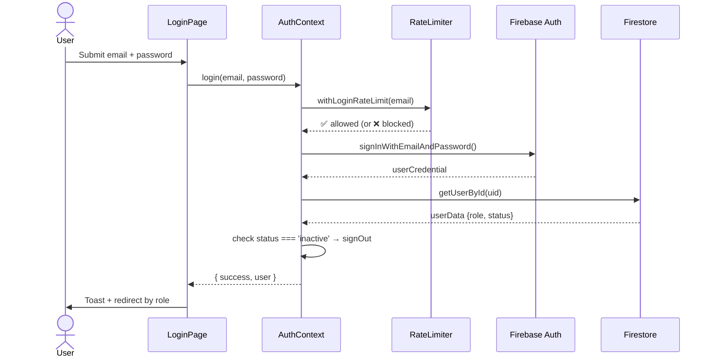
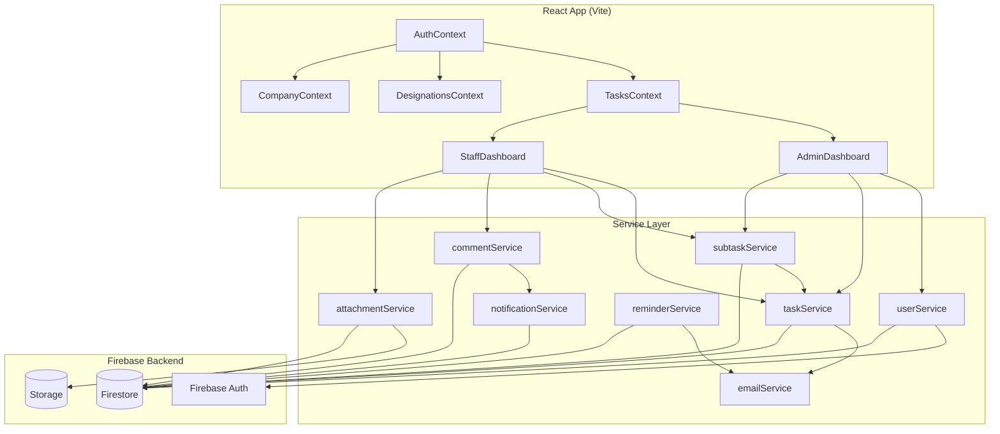
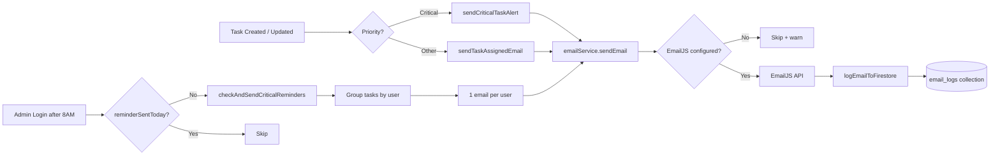
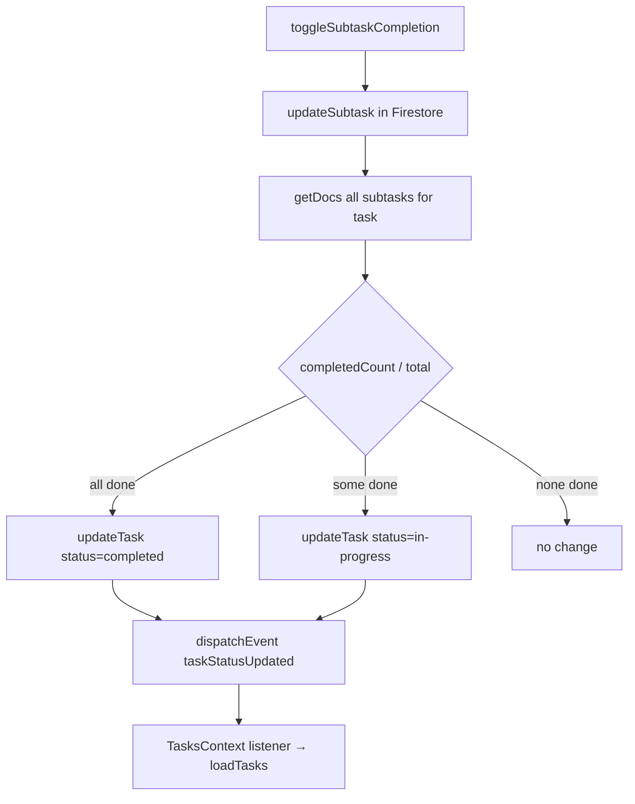
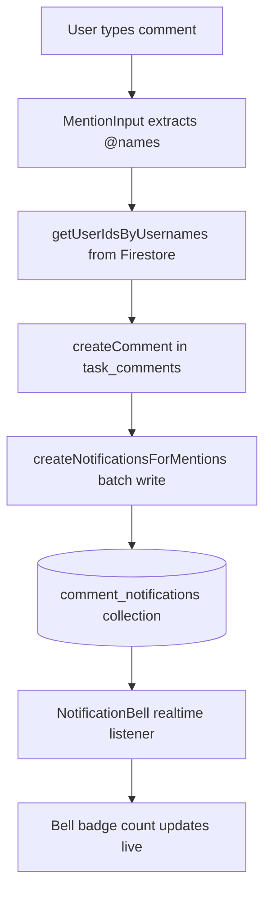
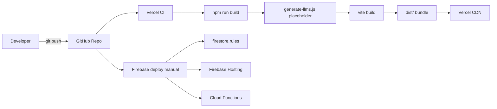

# 🌊 MagnaFlow — Pipeline & Workflow

---

## 1. Authentication Flow



**Role → Route mapping:**
| Role | Redirects To |
|:---|:---|
| `admin` | `/admin` |
| `staff` | `/staff` |
| `manager` | `/staff` ⚠️ (bug BUG-12) |

---

## 2. Task Lifecycle

```mermaid
stateDiagram-v2
    [*] --> pending : Admin creates task
    pending --> in-progress : Staff updates status\nor subtask completed
    in-progress --> completed : Staff marks done\nor all subtasks done
    pending --> completed : Direct completion
    completed --> [*]

    note right of pending
        Email sent on assignment
        Critical → alert email
    end note
    note right of completed
        completedAt timestamp set
    end note
```

---

## 3. Data Flow Pipeline



---

## 4. Email Notification Pipeline



---

## 5. Subtask Auto-Status Pipeline



---

## 6. Comment & Mention Pipeline



---

## 7. Build & Deploy Pipeline



**Build output:**
| Asset | Gzip Size |
|:---|:---|
| `index.css` | 9.78 kB |
| `index.js` (main) | **825 kB** ⚠️ |
| `html2canvas` chunk | 47 kB |
| `purify` chunk | 8.6 kB |

---

## 8. Role & Component Access Matrix

| Component | admin | staff | manager | principal | alpha |
|:---|:---:|:---:|:---:|:---:|:---:|
| AdminCommandCenter | ✅ | ❌ | ❌ | ❌ | ❌ |
| StaffManagement | ✅ | ❌ | ❌ | ❌ | ❌ |
| TaskManagement | ✅ | ✅ | ⚠️ | ⚠️ | ⚠️ |
| PerformanceReports | ✅ | ❌ | ✅ | ✅ | ✅ |
| DepartmentOverview | ❌ | ❌ | ✅ | ❌ | ❌ |
| PrincipalDashboard | ❌ | ❌ | ❌ | ✅ | ❌ |
| AlphaDashboard | ❌ | ❌ | ❌ | ❌ | ✅ |

> ⚠️ = Component exists but routing not wired — users are redirected to `/staff`

---

## 9. Security Layer Stack

```
Request
  └── Firebase Auth JWT (token verification)
        └── Firestore Security Rules (RBAC)
              ├── Staff: read own profile + assigned tasks only
              ├── Admin: full read/write
              └── Anyone else: denied
Client-side
  ├── RateLimiter (5 attempts / 15 min — in-memory ⚠️)
  ├── Input validation (validation.js)
  └── XSS sanitization (DOMPurify via sanitizeString)
```
